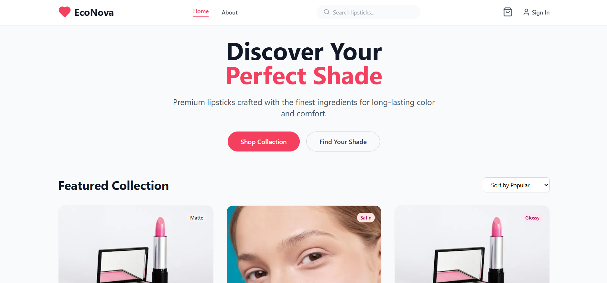
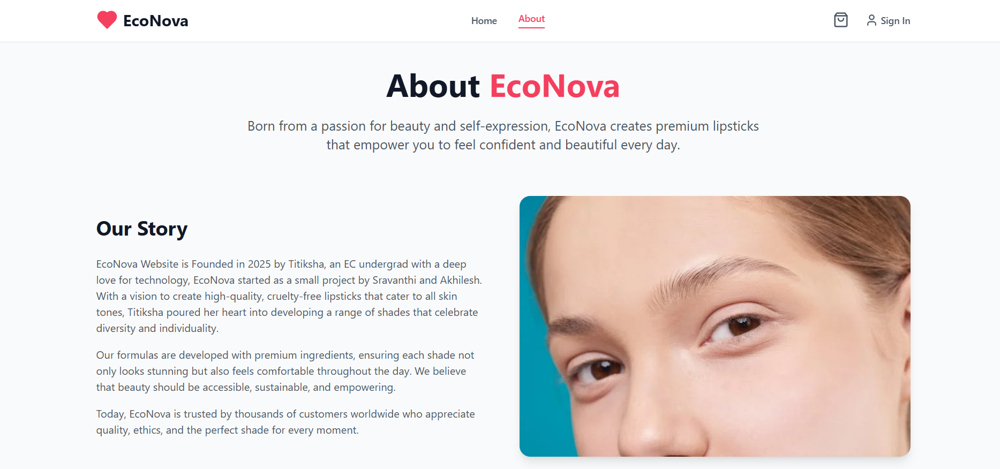
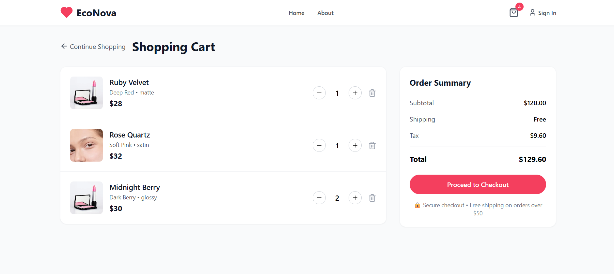
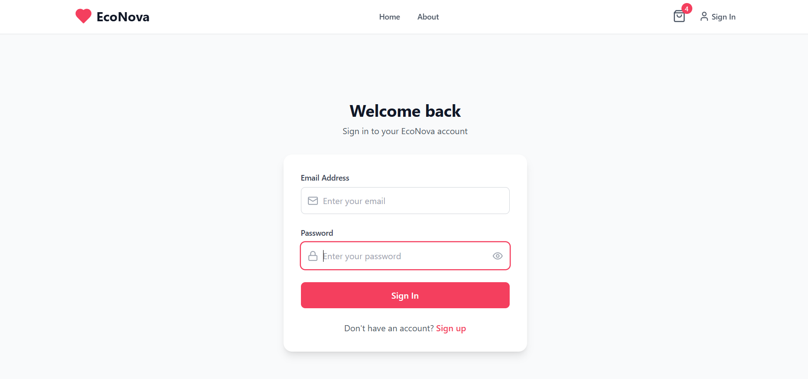

# 💄 Econova — Lipstick E-commerce Website

Welcome to **Econova**, your go-to virtual boutique for exploring and shopping premium lipsticks. Designed with elegance and built for performance, Econova offers a sleek and user-friendly shopping experience tailored for beauty enthusiasts.

---

## ✨ Features

- 🛍️ Modern, responsive e-commerce interface
- 🔎 Product browsing with filters & categories
- 🧾 Cart and checkout flow
- 🔐 Admin & customer authentication panels
- 📦 Real-time inventory & order tracking (optional)

---

## 🧰 Tech Stack

- **Frontend**: React.js, Tailwind CSS
- **Backend**: Node.js, Express
- **CMS**: Payload CMS
- **Database**: MongoDB
- **Deployment**: Vercel / Netlify / Render *(configurable)*

---

## 📸 Screenshots

| Landing Page | Product Listing |
|--------------|-----------------|
|  |  |

| Product Page | Admin Panel |
|--------------|-------------|
|  |  |

---

## 🚀 Getting Started

### 1. Clone the repo
```bash
git clone https://github.com/your-username/econova.git
cd econova  
